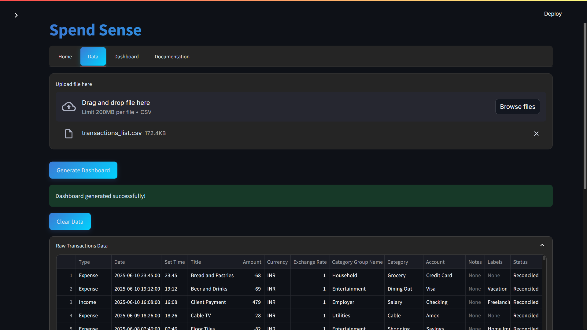
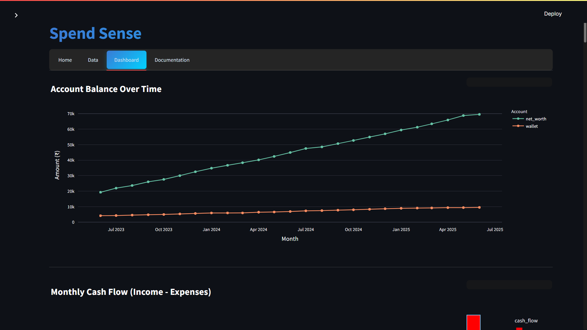
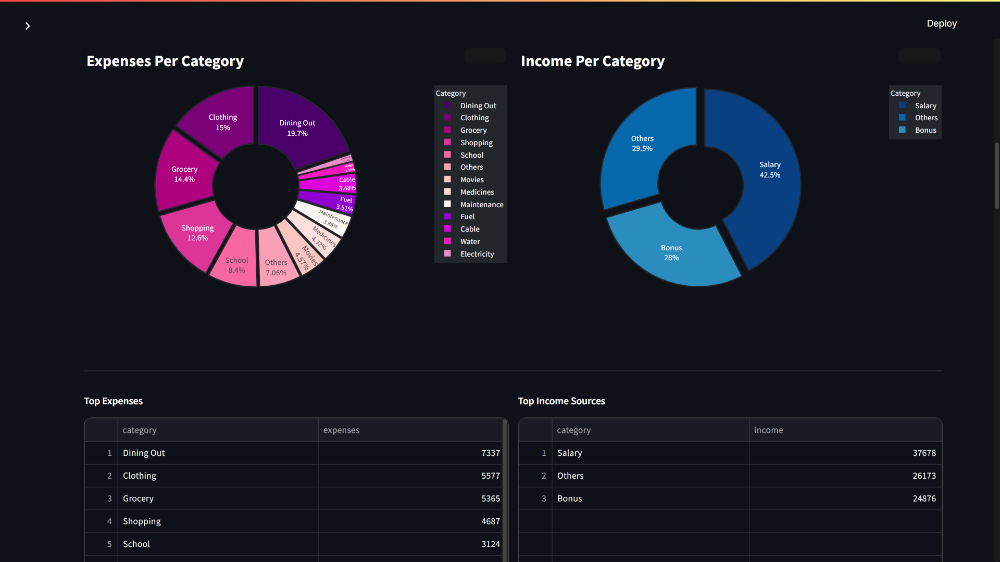
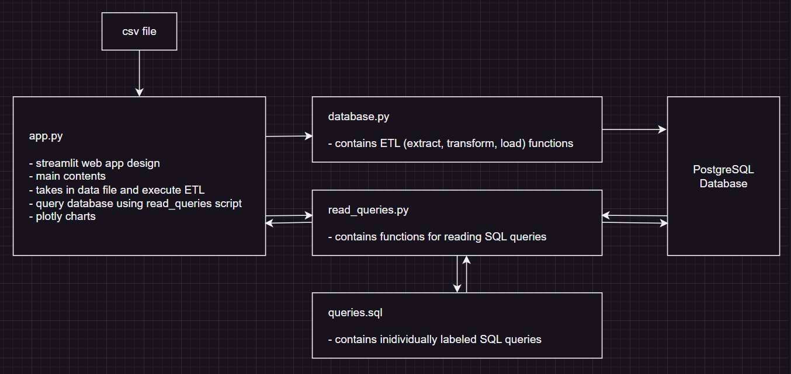

# SpendSense

## Project Overview
SpendSense extracts expenditure data from Bluecoins and creates a dashboard to aid in budgeting and financial management. 
Bluecoins is an expense tracking app that allows export of data in CSV format. SpendSense takes this file or 
any other file with the same CSV format to generate analytics.

## Project Snapshots




## Motivation Behind the Project

As an Indian student, managing my finances has always been a challenge—especially with limited pocket money and the need to balance studies, personal life, and unexpected expenses. For over a year, I’ve used the Bluecoins app to track every rupee spent and earned. Now, I want to go beyond just recording transactions and uncover meaningful insights from my own data.

With this project, I aim to answer key questions about my spending and income habits:

- **Where do I spend the most rupees?**  
  Identifying my biggest expenses helps me prioritize and adjust my habits.
- **What should my daily, weekly, and monthly budget look like in rupees?**  
  Using my actual spending patterns, I want to set realistic and sustainable budgets in ₹.
- **Where does most of my money come from?**  
  Understanding my income sources helps me plan better for the future.
- **What are my most preferred payment and receiving methods?**  
  Knowing which methods I use most often can help me streamline my finances.
- **How much money moves in and out of my accounts over time in rupees?**  
  Tracking cash flow trends ensures I stay on top of my financial health.

This project is also a chance for me to apply what I’ve learned as a computer science student. I’ve used:

- **Python** (including Pandas for data analysis, SQLAlchemy for database integration, Plotly for visualizations, and Streamlit for the web interface)
- **SQL** (relational databases and writing queries)
- **Git workflow** (version control and collaboration)
- **Project management and documentation** (to keep everything organized and reproducible)

By building this financial tracker, I hope to not only manage my money better but also grow my skills in programming, data analysis, and web development—while keeping every rupee in check!

## Technology


## Architecture



## To Run
1. Clone the repo
```shell
git clone https://github.com/vinzalfaro/personal-finance-dashboard.git
```
2. Build the Docker images using docker-compose:
```bash
docker-compose build
```
3. Run the Docker containers:
```bash
docker-compose up
```
4. Open your browser and go to `localhost:8501`.
